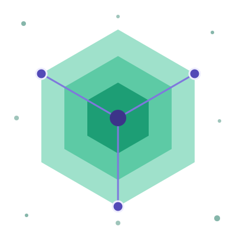

<p align="center">
  
</p>

# SaltMix — A Layered-Security Mixnet Concept

> **Status:** Proof of Concept / Design Document
> **Goal:** Explore an extended mixnet architecture that stacks additional cryptographic, traffic-analysis, and network-level defenses on top of the classic Chaumian mix model (as used by Nym, Loopix, and similar systems).

---

## 1. Motivation

Classic mixnets solve the core problem of unlinkability between sender and receiver by routing messages through a sequence of mix nodes, each of which re-encrypts and reorders traffic. However, several attack surfaces remain in practical deployments:

- **Tagging attacks** — an adversary who controls entry and exit nodes can mark packets to correlate them.
- **Timing correlation** — even with mixing delays, statistical timing analysis can de-anonymize low-latency traffic.
- **Sybil attacks** — an adversary running many nodes can increase the probability of controlling multiple hops on a single path.
- **Metadata leakage** — directory lookups, packet sizes, and control-plane traffic can leak information even when payloads are encrypted.

**SaltMix** is a design exploration that layers additional defenses onto the base mixnet primitive to raise the cost of each of these attacks. It is *not* a production-ready system — it's a proof-of-concept intended to document the architecture, illustrate the cryptographic flow, and provide a reference implementation of the core packet format.

---

## 2. Architecture Overview



The client performs local, diversity-constrained path selection using the node list published by the directory authority, then constructs a Sphinx packet with per-hop salting. Each mix node applies one additional defense layer (salting + delay, cover traffic, SURB handling) before the message reaches its destination.

Each node only ever learns:
- The address of the previous hop
- The address of the next hop
- Its own decryption layer

No node can determine the full path, and no external observer can correlate packets across hops without breaking the per-hop salt or defeating the timing obfuscation.

---

## 3. Core Security Layers

### 3.1 Per-Hop Salted Sphinx Packets

The classic [Sphinx packet format](https://cypherpunks.ca/~iang/pubs/Sphinx_Oakland09.pdf) is extended so that **every hop** applies a fresh random salt before re-encryption. This ensures that even byte-for-byte identical payloads produce cryptographically unrelated ciphertexts at each hop, preventing tagging attacks where an adversary marks a packet at ingress and looks for the same pattern at egress.

```python
# Simplified illustration — NOT for production use
import os
import hashlib

def salt_layer(payload: bytes, hop_key: bytes) -> bytes:
    salt = os.urandom(16)
    salted = hashlib.blake2b(hop_key + salt + payload, digest_size=32).digest()
    return salt + salted  # salt is prepended, stripped by the node during processing
```

### 3.2 Layered (Onion) Encryption

Standard onion-style encryption: the client encrypts the message once per hop, in reverse order, so each node peels off exactly one layer. Combined with the salting above, this means the plaintext structure is never exposed mid-path.

### 3.3 Poisson Mixing (Continuous-Time Delay)

Instead of fixed-size batching (which creates predictable time windows), each node delays forwarding by a duration drawn from an exponential distribution:

```python
import random

def mixing_delay(mean_delay_seconds: float = 2.0) -> float:
    return random.expovariate(1 / mean_delay_seconds)
```

This is the same approach used by Loopix and makes end-to-end timing correlation significantly harder without requiring synchronized batch windows across the network.

### 3.4 Cover Traffic / Decoy Loops

Idle nodes periodically emit dummy packets that are indistinguishable from real traffic to external observers. Decoy loop packets travel through a random subset of the network and are discarded at a designated hop, so overall traffic volume does not correlate with real message volume.

### 3.5 Constant Packet Size + Padding

All packets — real or decoy, control or data — are padded to a fixed size before entering the network. This removes packet-size as a side channel.

### 3.6 Sybil Resistance via Staking

Node operators must lock a stake (economic bond) to participate in path selection. Misbehavior (detected via reputation scoring, see below) results in stake slashing. This raises the cost of running a large number of malicious nodes.

### 3.7 Diversity-Constrained Path Selection

The client's path-selection algorithm avoids choosing multiple hops from the same autonomous system (AS), country, or operator, reducing the chance that a single adversary controls more than one hop on a given path.

```python
def select_path(nodes, hop_count=3):
    """Greedy diversity-constrained path selection (illustrative only)."""
    path = []
    used_as = set()
    used_country = set()
    candidates = nodes.copy()
    random.shuffle(candidates)

    for node in candidates:
        if len(path) >= hop_count:
            break
        if node.asn in used_as or node.country in used_country:
            continue
        path.append(node)
        used_as.add(node.asn)
        used_country.add(node.country)

    if len(path) < hop_count:
        raise ValueError("Insufficient diverse nodes available")
    return path
```

### 3.8 Single-Use Reply Blocks (SURBs)

For reply traffic, the client precomputes a reusable-once return path so the responder never needs to know the sender's identity or path to reply.

---

## 4. Threat Model

| Adversary Capability | Mitigation |
|---|---|
| Passive network observer | Constant packet size, padding, cover traffic |
| Malicious entry/exit node | Per-hop salting, layered encryption |
| Global passive adversary (partial) | Poisson mixing, decoy loops |
| Sybil node operator | Staking, reputation scoring, diversity constraints |
| Directory compromise | BFT-based directory authority (see §5) |

**Out of scope for this PoC:** protection against a fully global active adversary with real-time compromise of a majority of nodes; protection against endpoint compromise (malware on the client/server itself).

---

## 5. Directory Authority

Node lists are maintained via a small BFT (Byzantine Fault Tolerant) consensus cluster rather than a single trusted directory server, reducing the single point of failure/trust present in some mixnet designs.

---

## 6. Repository Structure (proposed)

```
saltmix/
├── client/
│   ├── path_selection.py
│   ├── sphinx_packet.py
│   └── surb.py
├── node/
│   ├── mixer.py
│   ├── cover_traffic.py
│   └── reputation.py
├── directory/
│   └── bft_consensus.py
├── docs/
│   └── threat_model.md
└── README.md
```

---

## 7. Status & Disclaimer

This is a **design-stage proof of concept**. The code snippets above are illustrative and intentionally simplified — they are **not** audited, not constant-time where required, and not suitable for real-world anonymity guarantees as-is. Building a production anonymity network requires peer review from cryptographers, formal analysis of the mixing strategy, and extensive adversarial testing.

Contributions, critiques, and threat-model reviews are welcome via issues/PRs.

## 8. References

- Danezis & Goldberg, *Sphinx: A Compact and Provably Secure Mix Format*
- Piotrowska et al., *The Loopix Anonymity System*
- Nym Technologies, *Nym Network Whitepaper*
- Chaum, *Untraceable Electronic Mail, Return Addresses, and Digital Pseudonyms*

## 9. License

GNU Affero General Public License v3.0 (AGPL-3.0) — Copyright (C) 2026 CSTRSK. See [LICENSE](LICENSE) for details.

AGPL-3.0 was chosen deliberately over a permissive license: it's a copyleft license that also covers network use — anyone who runs a modified version of SaltMix as a public service must make their modified source available to users of that service, not just to people they distribute binaries to. This closes the "SaaS loophole" that permissive and even standard GPL licenses leave open, which matters for network infrastructure like a mixnet where the whole point is trust in what's actually running.

